# PDF Intelligence Portal — 시스템 아키텍처

> 최종 수정: 2026-06-02

---

## 1. 비즈니스 시스템 아키텍처 (C4 Context)

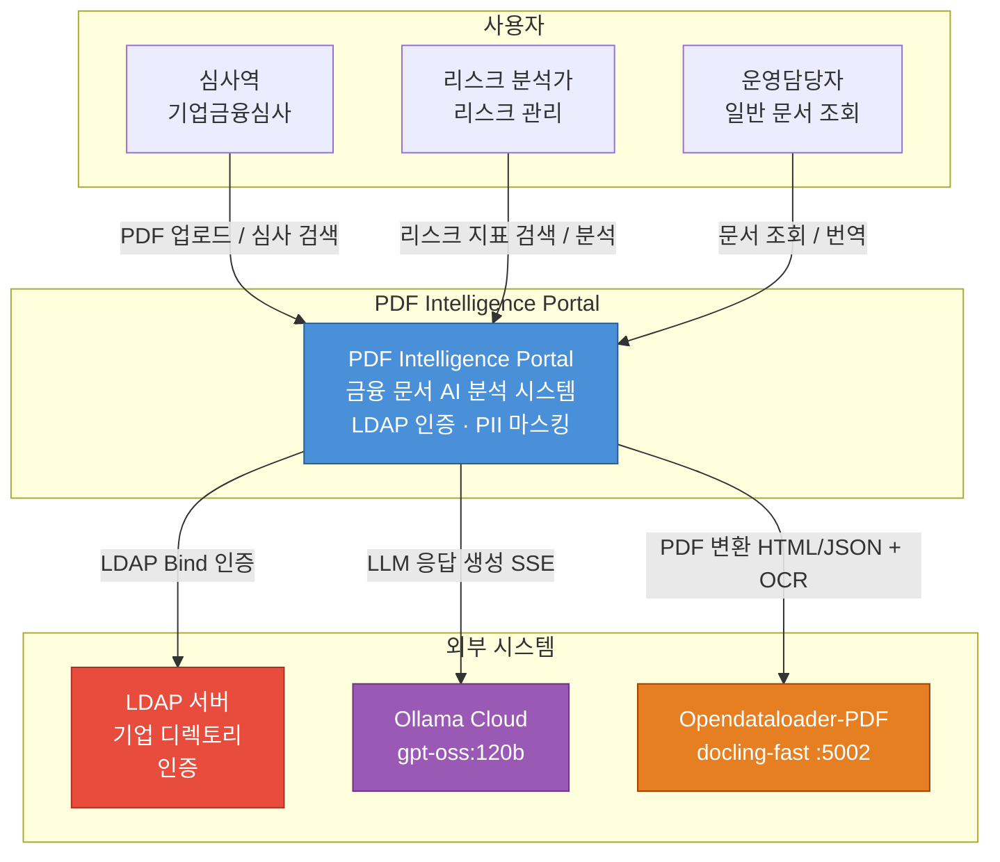

---

## 2. 시스템 아키텍처 (C4 Container)

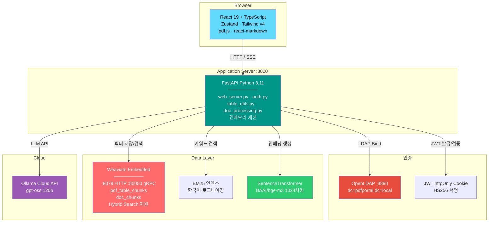

---

## 3. 컴포넌트 아키텍처

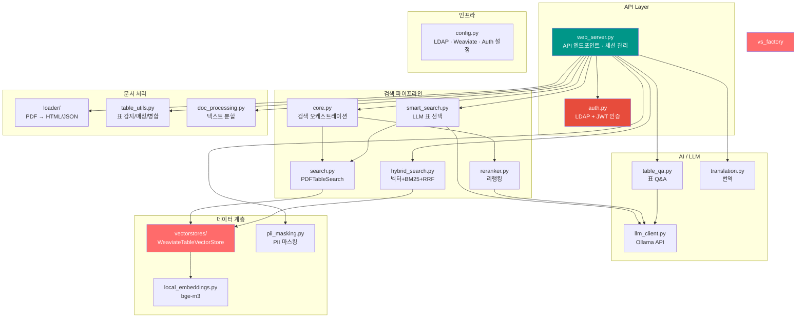

---

## 4. 데이터 플로우

### 4.1 PDF 업로드 & 인덱싱

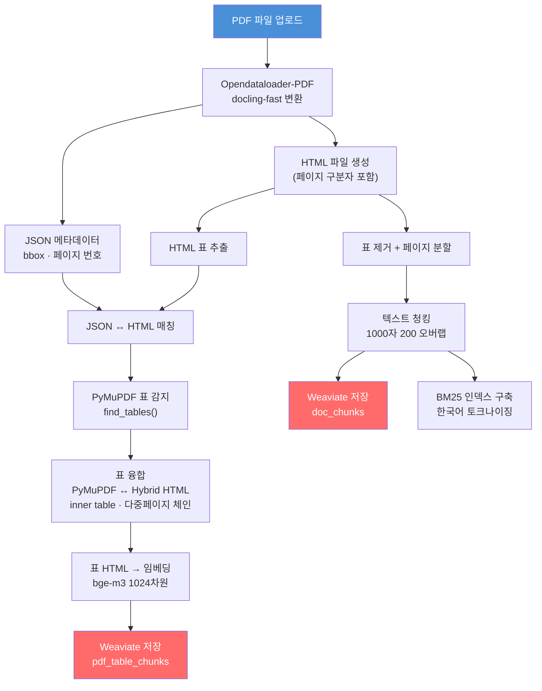

### 4.2 통합 문서 검색

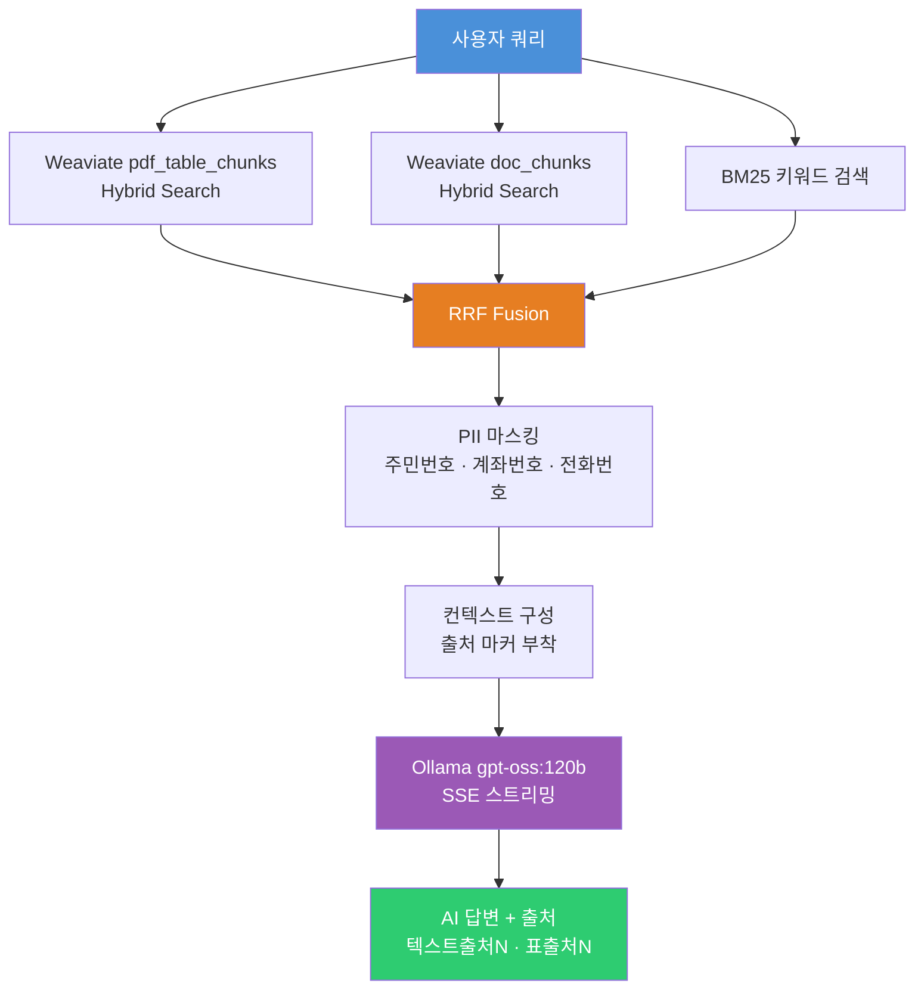

---

## 5. 시퀀스 다이어그램

### 5.1 LDAP 인증

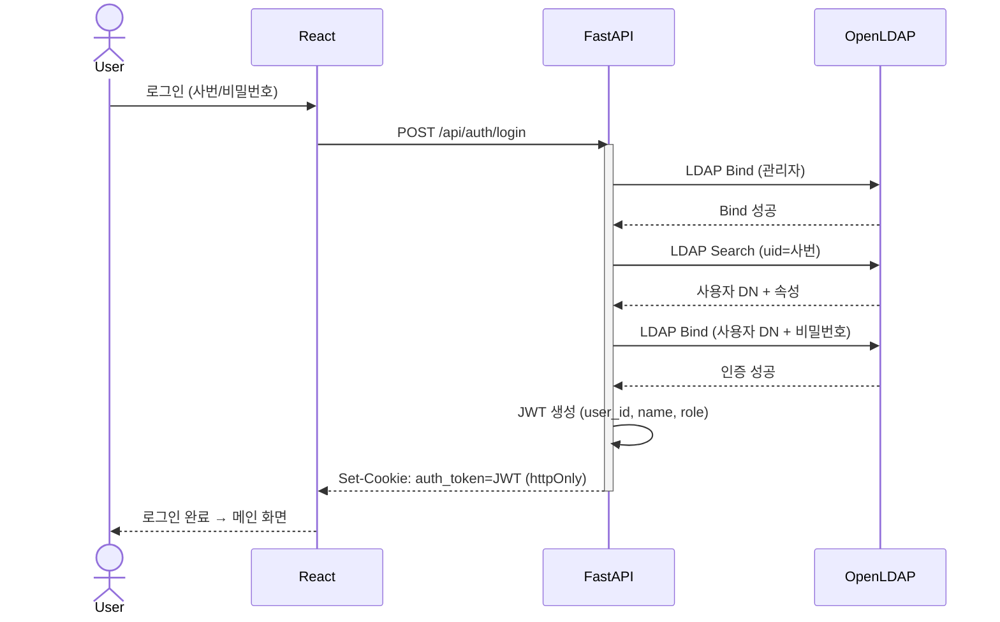

### 5.2 PDF 업로드 & 표 추출

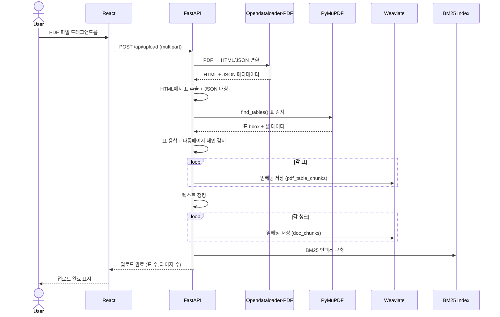

### 5.3 통합 문서 검색

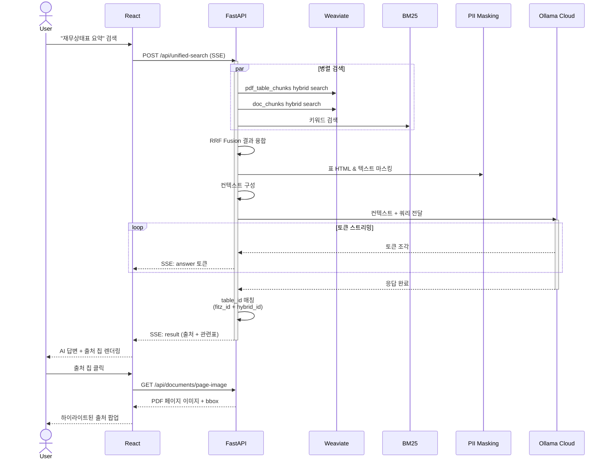

### 5.4 문서 보기

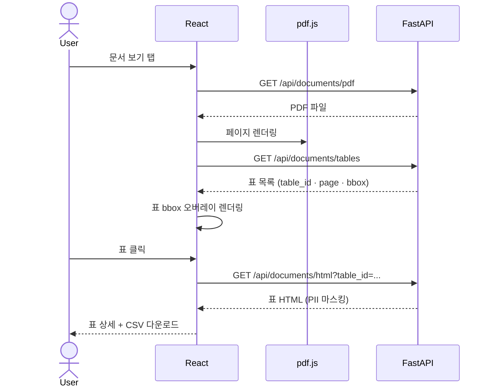

### 5.5 표 Q&A

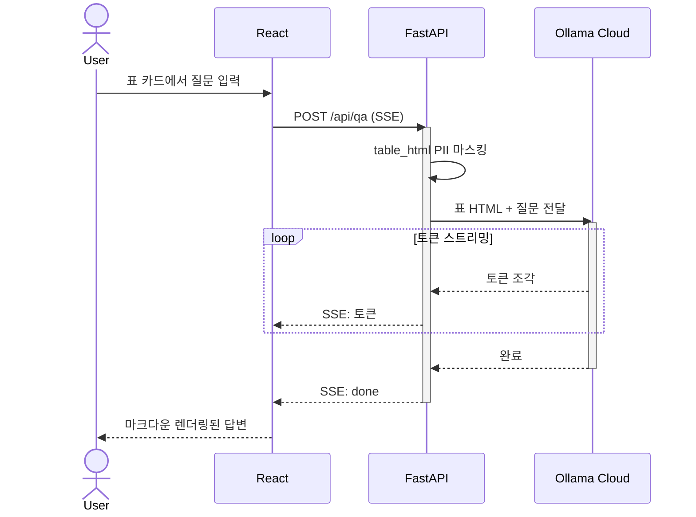

---

## 6. API 엔드포인트 맵

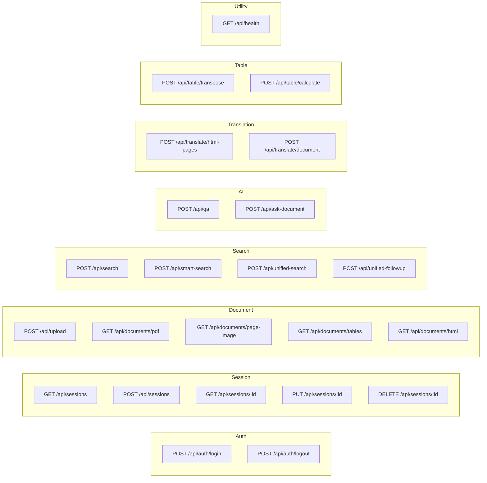

---

## 7. 핵심 설계 결정

### 7.1 벡터 DB (Weaviate)

```
Weaviate Embedded :8079/:50050
  ├── PdfTables 컬렉션 (표 임베딩)
  └── DocChunks 컬렉션 (텍스트 청크 임베딩)
      Hybrid Search 지원 (벡터 + 키워드)
```

`vectorstores/weaviate_store.py`의 `WeaviateTableVectorStore`가 `VectorStoreBackend` 프로토콜을 구현합니다.

### 7.2 table_id 이중 매칭

```
Weaviate에 저장된 표 ID:  table_7_910  (hybrid/opendataloader-pdf 포맷)
세션에 저장된 표 ID:      fitz_p1_0    (PyMuPDF 매칭 후 생성)

매칭 로직:
  1. table_id 직접 비교
  2. hybrid_table_id 폴백 비교 (table_utils.py에서 보존)
```

### 7.3 좌표계 (bbox)

```
PDF 좌표계 (docling, opendataloader-pdf)    PyMuPDF 좌표계 (fitz)
┌─────────────────────┐                     ┌─────────────────────┐
│ (0, max_y) ←→ (max) │                     │ (0,0)       → (max) │
│        ↑ y↑          │                     │        ↓ y↓          │
│ 원점: 왼쪽 하단       │                     │ 원점: 왼쪽 상단       │
└─────────────────────┘                     └─────────────────────┘

docling/opendataloader-pdf bbox: 이미 PDF coords → 변환 금지
PyMuPDF (fitz) bbox: PDF coords로 변환 필요
하이라이트 오버레이: 항상 PyMuPDF(fitz) bbox 우선 사용
```

### 7.4 표 감지 융합 전략

```
PyMuPDF find_tables()  +  Hybrid (opendataloader-pdf)
        ↓                           ↓
    outer tables              HTML tables
        ↓                           ↓
    ┌─────────────────────────────────┐
    │ 1. PyMuPDF outer → HTML 매칭    │
    │    (텍스트 유사도 + y좌표 오버랩) │
    │ 2. 매칭 성공 → hybrid HTML 사용  │
    │    bbox는 hybrid 것 우선         │
    │ 3. 매칭 실패 → PyMuPDF HTML 폴백 │
    │ 4. Hybrid 전용 표 → fallback 추가│
    │ 5. 다중페이지 표 체인 감지        │
    └─────────────────────────────────┘
```

### 7.5 PII 마스킹 적용 범위

- **RAG 검색 결과**: 표 HTML, 텍스트 청크 모두 마스킹
- **문서 보기**: 표 HTML 렌더링 시 마스킹
- **출처 팝업**: PDF 하이라이트 텍스트 마스킹
- **Q&A**: 사용자 질문 히스토리 정제

### 7.6 인증 플로우

```
1. POST /api/auth/login {user_id, password}
   → LDAP Bind (관리자 DN) → LDAP Search (uid) → LDAP Bind (사용자 DN)
   → JWT 생성 (user_id, name, role) → httpOnly Cookie Set

2. 이후 모든 API 요청
   → Cookie에서 JWT 추출 → 검증 → user_id 주입

3. POST /api/auth/logout
   → Cookie 삭제
```

### 7.7 세션 관리

- **저장소**: 인메모리 `_sessions` 딕셔너리 (서버 재시작 시 손실)
- **격리**: 각 세션 = 독립 임시 디렉토리 (업로드, Weaviate, BM25)
- **정리**: 세션 삭제 시 임시 디렉토리 `shutil.rmtree()`
